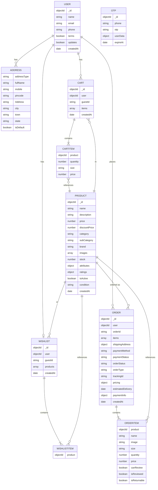

# E-Commerce Platform - Entity Relationship Diagram

## ER Diagram



## How to Export to JPG/PNG

### Option 1: Using Mermaid Live Editor (Online)
1. Visit https://mermaid.live
2. Copy the code from the mermaid block above
3. Paste it in the editor
4. Click the "Save diagram" button
5. Choose your export format (PNG, JPG, SVG, etc.)

### Option 2: Using VS Code
1. Install "Markdown Preview Mermaid Support" extension
2. Open this file in VS Code
3. Right-click on the diagram → Download as PNG/SVG

### Option 3: Using Docker (Local)
```bash
docker run --rm -v /path/to/output:/output:rw -v /path/to/file:/input:ro mermaid-cli -i /input/diagram.md -o /output/diagram.png
```

## Database Relationships Summary

| Entity | Relationships |
|--------|---------------|
| **USER** | Has many addresses, carts, wishlists, orders |
| **PRODUCT** | Referenced in carts, wishlists, and orders |
| **CART** | Belongs to user (or guest); Contains items |
| **WISHLIST** | Belongs to user (or guest); Contains products |
| **ORDER** | Belongs to user; Contains items; Has shipping address |
| **ADDRESS** | Belongs to user; Supports multiple addresses |
| **OTP** | Temporary record for authentication |

